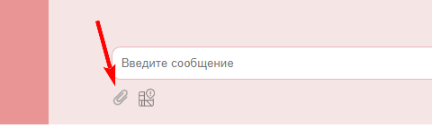
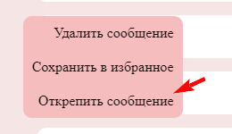

# Мессенджер chatmel

### Реализованы следующие функции:

* Сохранение в истории текстовых сообщений
* Сохранение в истории ссылок (то, что начинается с http:// или https://). Они кликабельны и отображаются как ссылки:

* Добавление в сообщение (и сохранение в истории) изображений, видео и аудио (как файлов) - через Drag & Drop и через иконку загрузки:

Выбранные для отправки файлы можно удалить из отправляемого сообщения, нажав на "крестик" в правом верхнем углу файла:

* Возможно скачивание файлов (на компьютер пользователя). Можно воспользоваться появляющимся на медиа-файлах меню:

* При загрузке сообщений чатов сначала подгружаются последние 10 сообщений, при прокрутке вверх подгружаются следующие 10 и т.д.
* Для отправка геолокации в формате [широта, долгота] необходимо воспользоваться кнопкой, расположенной под полем ввода сообщения:

* Закрепление сообщений, закреплять можно только одно сообщение. Оно прикрепляется к верхней части страницы:

Чтобы закрепить сообщение необходимо воспользоваться контекстным меню стоя на сообщении:

Для открепления сообщения нужно воспользоватья контекстным меню
 
или "крестиком на закрепленном сообщении
 
При попытке прикрепить второе сообщение выйдет предупреждающее сообщение:
 
* Можно добавить сообщения в избранное, воспользовавшись контекстным меню:
 
Для доступа к сохраненным сообщениям используется отдельная вкладка бокового меню.
Для удаления из избранного необходимо воспользоваться контекстным меню

или кнопкой "крестик" на сообщении, при просмотре его на вкладке избранных

* Возможен просмотр вложений по категориям (аудио, видео, изображения). Необходимо выбрать вкладку бокового меню "Файлы".

* Реализован интерфейс для отправки команд боту. Для перехода необходимо нажать в боковом меню слева кнопку "Бот". Далее, нажимая кнопки в списке команд, получаем ответ от бота
